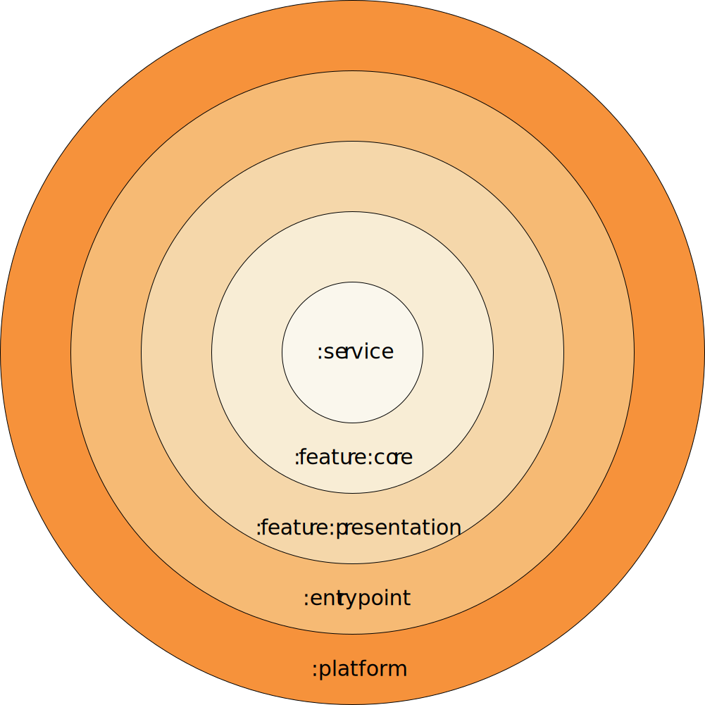

# FLIP — Feature-Layered Isolated Platform

[](https://medium.com/@numq/flip-modular-architecture-for-kmp-1ce424f6c92f)
[](https://dev.to/numq/flip-modular-architecture-for-kmp-89c)

**FLIP** is an architectural pattern for Kotlin Multiplatform (KMP) applications that enforces strict module boundaries
through dependency rules rather than conventions.

<p align="center">
  
</p>

## Table of Contents

- [Overview](#overview)
    - [Layers](#layers)
    - [Dependency Rules](#dependency-rules)
        - [Core Rules](#core-rules)
        - [Evolution](#evolution)
        - [Service Layer](#service-layer)
        - [Feature Layer](#feature-layer)
        - [UseCase Rule](#usecase-rule)
        - [Slot-Based Composition](#slot-based-composition)
- [When to Use FLIP](#when-to-use-flip)
- [Comparison](#comparison)
- [License](#license)

## Overview

FLIP organizes code into five layers. Each layer has a single responsibility and a strictly defined set of dependencies.

### Layers

| Layer                     | Purpose                        | Depends on                                     |
|---------------------------|--------------------------------|------------------------------------------------|
| `:common:core`            | Common logic                   | Nothing                                        |
| `:common:presentation`    | Common presentation            | `:common:core`                                 |
| `:entrypoint`             | DI assembly + slot composition | `:common:presentation`, `:feature`, `:service` |
| `:feature:*:core`         | Feature domain                 | `:common:core`, `:service:*`                   |
| `:feature:*:presentation` | Feature presentation           | `:common:presentation`, `:feature:*:core`      |
| `:platform`               | Platform entry point           | `:entrypoint`                                  |
| `:service`                | Domain without presentation    | `:common:core`                                 |

## Dependency Rules

<p align="center">
  
</p>

### Core Rules

1. **No horizontal dependencies.** Features cannot depend on other features. Services cannot depend on other services.
2. **Dependencies flow downward.** Platform → Entrypoint → Feature → Service → Common.
3. **A service and a feature cannot share the same name.** If `:service:foo` exists, `:feature:foo` must not exist — use
   `:feature:bar` instead. This prevents logic duplication.

### Evolution

FLIP grows with your project.

**Stage 1: Single feature**
`:common`, `:feature`, `:entrypoint`, `:platform`

**Stage 2: Multiple features**
Add more `:feature` modules. Features must not depend on each other.

**Stage 3: Shared functionality**
Extract `:service` when two or more features share the same data or logic.

You don't need `:service` from day one.

### Service Layer

A `:service` is a **domain service without presentation**. It contains:

- Domain models
- A public interface (e.g., `UserService`)
- An internal implementation (e.g., `LocalUserService`)

Services are the only communication channel between features. A feature that needs data from another domain must depend
on its service.

### Feature Layer

A `:feature` always has two submodules:

- `:core` — presentation domain (UseCases, optional presentation services)
- `:presentation` — Compose UI

A feature **must not** duplicate the domain logic of a service. If `:service:user` receives a list of users, then
`:feature:profile` focuses on the user interface state: displaying a profile based on the user's data.

### UseCase Rule

A UseCase in `:feature:*:core` depends on:

- Its own presentation service
- External services from `:service:*`

```kotlin
class UpdateProfile(
    private val profileService: ProfileService,  // internal domain
    private val userService: UserService,        // external domain
) : UseCase<UpdateProfile.Input, Unit>
```

### Slot-Based Composition

Features are composed through slots in `:entrypoint`. A slot is a `@Composable` callback passed to the navigation
feature.

```kotlin
NavigationView(
    splash = {
        SplashView(applicationScope = applicationScope)
    },
    profile = {
        ProfileView(applicationScope = applicationScope)
    }
)
```

### When to Use FLIP

FLIP fits any project where you want compile-time guarantees that your modules won't turn into a big ball of mud.

- Building KMP applications of any size
- Multiple teams or developers working on different features
- You want strict isolation between features
- You prefer rules over conventions

### Comparison

| Pattern             | 	Module Isolation	     | UI Pattern               | 	Navigation    |
|---------------------|------------------------|--------------------------|----------------|
| FLIP	               | Compile-time (Gradle)	 | MVI (Feature + Reducer)	 | Slot-based     |
| Clean Architecture	 | Convention	            | Any	                     | Any            |
| Decompose           | 	Runtime	              | Any	                     | Component tree |
| Voyager	            | None	                  | Screen                   | 	Stack-based   |

## License

This project is licensed under the MIT License - see the [LICENSE](LICENSE) file for details.

___

<p align="center">
  <a href="https://numq.github.io/support">
    
  </a>
  <br>
  <a href="https://numq.github.io/support" style="text-decoration: none;">
    <code><font color="#bb9af7">numq.github.io/support</font></code>
  </a>
</p>